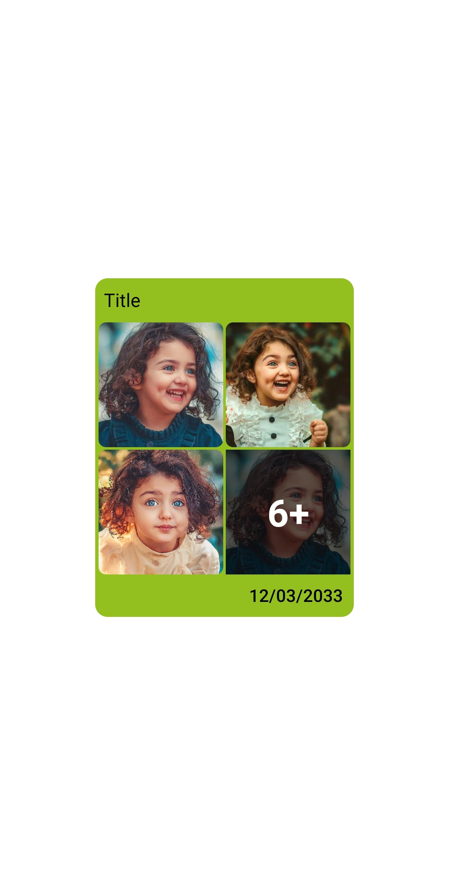
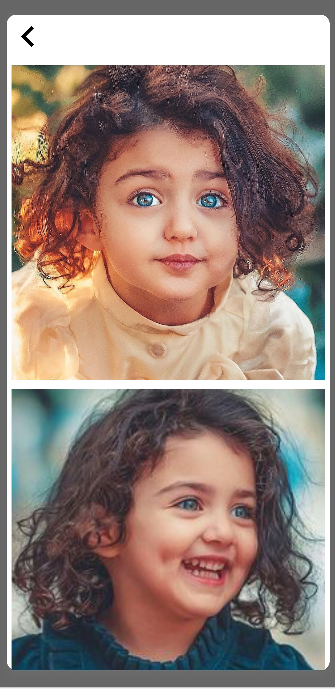
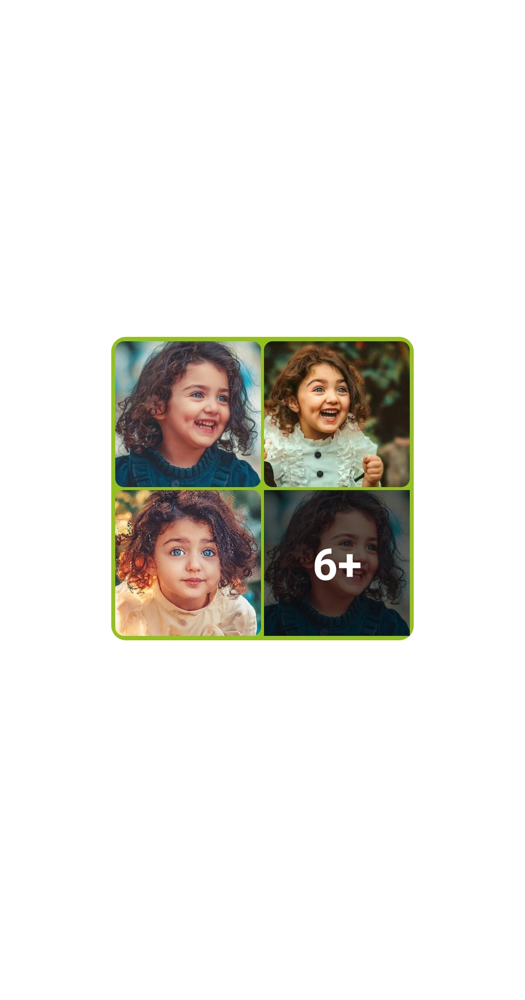

# Chat images view
 
 - Download the ChatImage.js file and import it in your project
 - Install npm install --save react-native-image-viewing
 
 ```
 import ChatImages from 'yourdir/ChatImages';
 
   const images = [
          {id:'IMG_1',uri:'https://i.pinimg.com/236x/cd/5f/16/cd5f16e1dd6ce0d458a5a3a553545096.jpg'},
          {id:'IMG_2',uri:'https://i.pinimg.com/236x/0b/8c/06/0b8c062e862a52ebd108caaa04004be8.jpg'},
          {id:'IMG_3',uri:'https://i.pinimg.com/originals/15/26/65/152665a9262714a0b924235529a3fec7.jpg'},
          {id:'IMG_4',uri:'https://i.pinimg.com/236x/cd/5f/16/cd5f16e1dd6ce0d458a5a3a553545096.jpg'},
          {id:'IMG_5',uri:'https://i.pinimg.com/550x/58/be/03/58be031ee4bf84378e1fdf353f9849d4.jpg'},
          {id:'IMG_6',uri:'https://yt3.ggpht.com/ytc/AMLnZu8RoU5MjaAayWDDzUlOU2XcVq1sZWxS-lfMLB8Wfw=s900-c-k-c0x00ffffff-no-rj'},
          {id:'IMG_7',uri:'https://cdn.sharechat.com/Anahitababy..._efc748e5-3d94-4c25-94d2-852411dec563-57c1383b-793a-42eb-baae-5a1fc1e61a98_cmprsd_40.jpg'},
          {id:'IMG_8',uri:'https://media.fuzia.com/assets/uploads/images/co_brand_1/article/2020/1586222795101-images-4.jpeg'},
          {id:'IMG_9',uri:'https://cdn-cf.sharechat.com/312a5c25-fad1-4110-9bf0-927dd180f41c-5384cd43-5311-4ff6-bebc-7594e902750c_compressed_thumb.jpeg'},
          {id:'IMG_10',uri:'https://cdn.sharechat.com/anahithafans_5232ba0_1599371810726_cmprsd_40.jpg'}];
          
           <ChatImages
                       images={images}
                       style={{backgroundColor:'#93C01F'}}
                       extra="12/03/2033"
                       title="Title"
                       titleStyle={{color:'#000000'}}
                     />

 ```
 
 
<p float="left">
   
      
   
   
   
   

</p>
